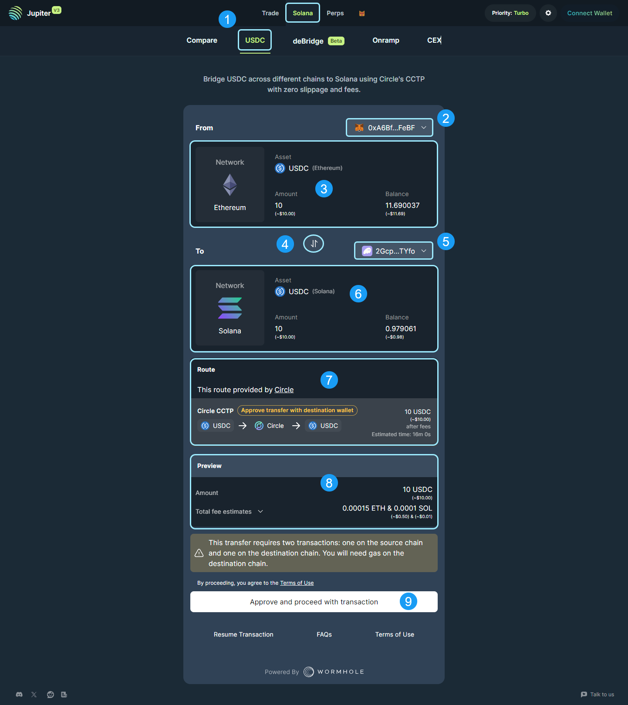
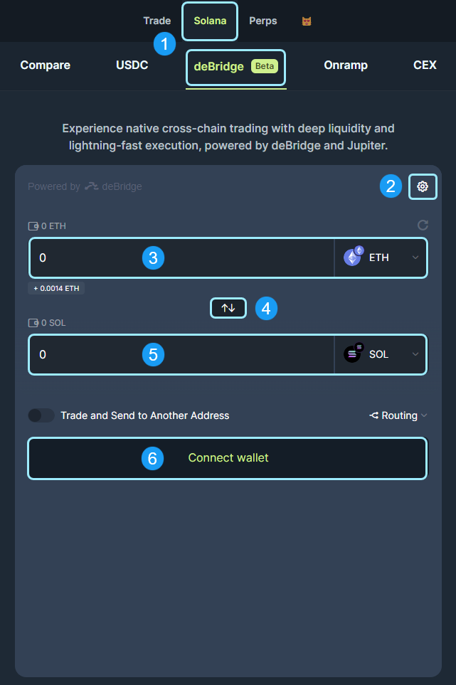
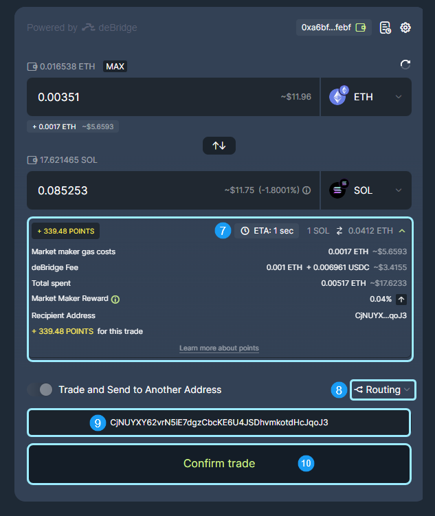

<head>
    <title>Bridging to Solana</title>
    <meta name="twitter:card" content="summary" />
</head>

The current crypto-sphere is made up of numerous blockchains which can act as silo's for assets and liquidity. With that in mind cross chain mobility for crypto assets is a highly desirable solution in this realm. Enter bridges, applications configured to manage asset custody and enable cross chain asset swapping. 

:::info 
Most bridge applications work in the same way. They require connecting multiple wallets (source & destination chains), selecting the input / output tokens and the input amount. They will also require at least 2 transactions confirming on both the source and destination chains.
:::

## Basic Bridging User Flow

1. Start on the bridge application you intend to use. 
2. Next, connect your source wallet that will be funding the bridging transaction.
3. Select the source token and input the amount that you want to use in the bridging transaction.
4. Connect the destination wallet that will be receiving the funds from the bridging transaction.
5. Select the token that you would like to bridge into on the destination chain.
6. Review the transaction preview to understand the total fees that the transaction will require.
7. Approve the bridge transactions. There will be two, one for the source chain and another for the destination chain.

## USDC - CCTP

The Cross-Chain Transfer Protocol (CCTP) is a permissionless on-chain utility that ensures secure USDC transfers between blockchains using a native burn-and-mint process. This bridge is powered by Wormhole and Circle.

### USDC Bridge UI

1. **USDC Bridge Selector:** Application selector to navigate to the USDC bridging tool.
2. **Source Wallet Connect:** Connect the wallet associated with the source blockchain you are looking to bridge from.
3. **Asset Selector & Amount Field:** Select the token from the source wallet and enter the amount of the token you would like to bridge.
4. **Destination / Source Switching Tab:** This will allow you to switch destination and source chains and tokens respectively.
5. **Destination Wallet Connector:** Connect the wallet associated with the destination blockchain you are looking to bridge to.
6. **Asset Selector & Amount Field:** Select the token on the destination blockchain you want to bridge to. The amount field is auto-calculated based on market rates and is un-editable.
7. **Route:** The best route is determined by the application and displayed here for you to review.
8. **Preview:** The bridging transaction preview will build here, identifying the Amount that will be received and the total fee estimates for the transaction. Note: There will be fees on both the source and destination blockchains as you have to execute transactions on both.
9. **Approve and Proceed with Transaction:** Once you have reviewed the Route and the Preview you this will start the bridging transaction process.

## deBridge

### deBridge UI

1. **deBridge Selector:** Application selector to navigate to the deBridge tool.
2. **Settings:** Source chain settings can be modified here, including gas fee, node selection and other settings native to the source blockchain.
3. **Source Chain & Token Selector:** Select the token from the source wallet and you can input the amount of the token you are looking to bridge as well. 
4. **Destination / Source Switching Tab:** This will allow you to switch destination and source chains and assets.
5. **Destination Chain & Token Selector:** Select the token in the destination wallet to bridge into. The amount field will auto-calculate for you based on exchange rates of the bridging route.
6. **Connect Wallet:** This button allows you to connect your source wallet to begin the bridging process. Once you connect, the UI will update and it will auto detect the wallet balances and populate the UI.

**Part Two Continued Below with the Updated UI with Wallet Connected.**

7. **Transaction ETA & Fee Breakdown:** Here you can review the fees on each blockchain as well as the bridging fee and destination address.
8. **Routing:** Expandable routing display to review the entire bridge route for the simulated transaction.
9. **Destination Wallet Address:** If displayed, enter your destination wallet address here. 
10. **Confirm Trade:** After reviewing the route, fees and token inputs click this button to confirm the trade and begin the bridging transactions. 